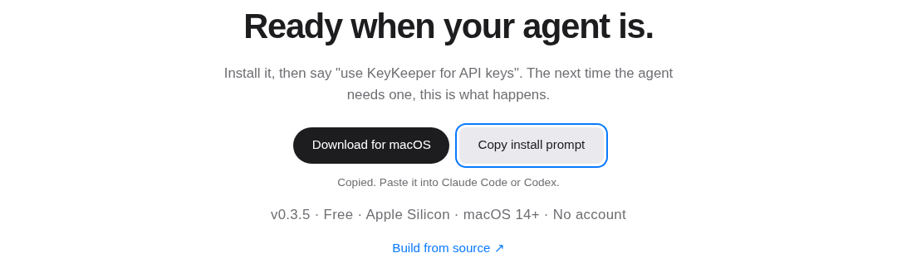
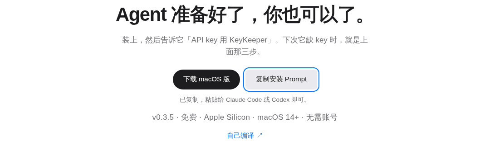
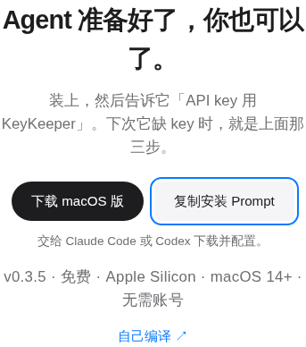
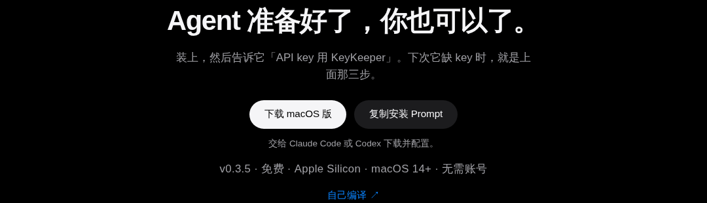
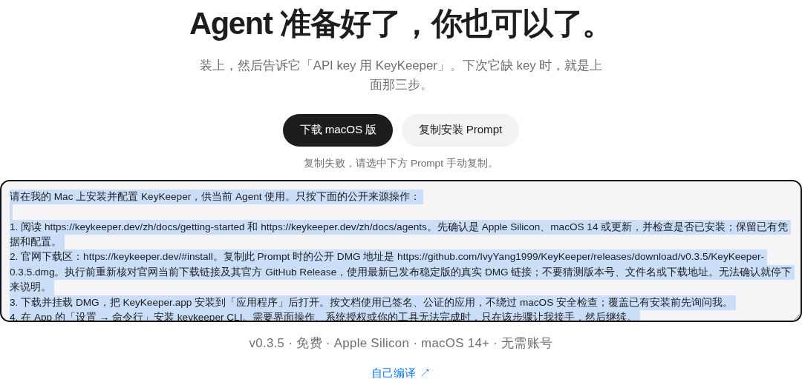

# Final layout evidence: 452b5d6

These six PNGs are the original bytes from successful [CI run 38040488996](https://github.com/IvyYang1999/keykeeper-landing/actions/runs/38040488996), captured from subject **452b5d654bd1f4c401f668fca4889ba447763043**, tree **3c54dacda5bde845dbddae35deae75de0bf429de**. They include the final `app/globals.css` layout change. The [manifest](manifest.json) binds that commit/tree, relevant source blobs, artifact ID and reported digest, and every image's SHA-256, size and dimensions.

A read-only checkout can open these files directly without dependencies or a browser. GitHub renders the gallery below. The evidence commit adds only documentation and exact PNG copies; every previously tracked file remains identical to the captured subject. The commit storing screenshots is intentionally a descendant of their tested source, rather than claiming screenshots can contain their own future Git commit hash. The older [8c0e717 gallery](../8c0e717/README.md) is historical evidence and does **not** cover the final CSS.

Codex personally opened all six images. Desktop controls align on a centered row and copied feedback appears below both buttons. At 375px English controls stack and Chinese controls fit on one row; visible labels and facts wrap without truncation. Dark colors remain readable across the section. Clipboard rejection shows failure feedback and selected manual-copy text below the buttons. These are isolated Linux CI headless captures of the public install section, not a production deployment, native Mac focus test or real application installation.

## English desktop: copied feedback, hover and keyboard focus

## Chinese desktop: copied feedback, hover and keyboard focus

## English mobile: 375px viewport

## Chinese mobile: 375px viewport

## Chinese dark mode: idle controls

## Clipboard rejected: selected manual-copy text

## Reused checks and remaining acceptance

The same immutable subject's CI passed build, lint, 23 existing unit tests, 215 unique sitemap URLs (XML, inventory, HTTP 200, canonical metadata and robots reference), both real clipboard flows, keyboard activation, feedback reset, denied-copy selection, locale persistence, 375/320px button bounds and existing download smoke. No changed gate was rerun to materialize this artifact.

Whole-page mobile overflow remains the recorded baseline: 375px current/baseline 421px, 320px current/baseline 356px. New controls add no overflow and fit inside the viewport. The 320px assertions are CI evidence; these six captures show 375px mobile layouts. This gallery covers the install section only.

**Search Console acceptance remains pending.** This repair does not deploy or submit a sitemap, and does not waive the required no-error receipt. After separate deployment and submission authorization, verify the production sitemap, submit its public URL, and retain the processing/error receipt tied to the deployed commit. CI success is not that receipt. The earlier appcast/download version discrepancy remains a separate existing release gate.

PR #2 was externally merged at 2026-10-10T09:13:10Z (merge commit `87efe21c03a01a974aa265168b7eb5e8d1b8d6b9`) before this evidence repair. This repair stays on `codex/sitemap-agent-install-cbb2139d`; it is not automatically part of that merged PR or `main`. No new PR, merge, force push, release or deployment is performed. The existing branch-specific automatic deployment guard remains unchanged.
