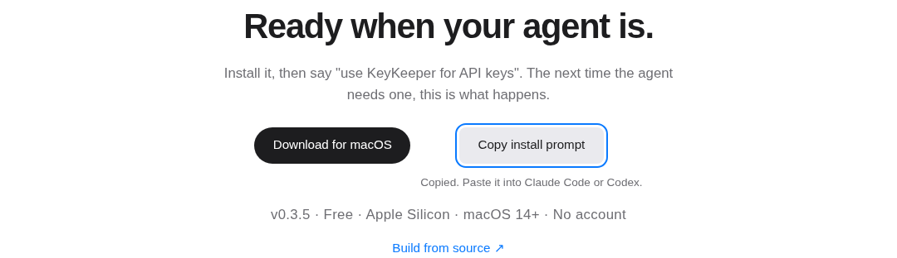
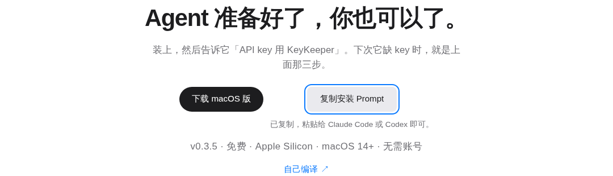
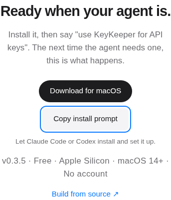
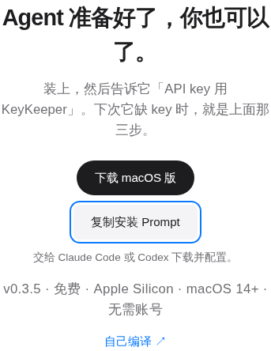
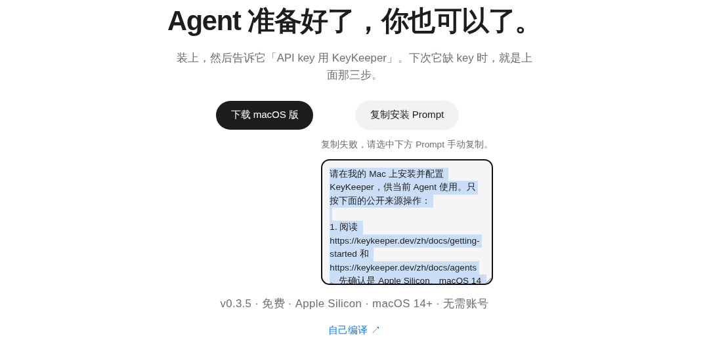

# Sitemap and install prompt acceptance evidence

These are the original screenshot bytes from the successful [CI run](https://github.com/IvyYang1999/keykeeper-landing/actions/runs/38038870930) for subject **8c0e717b56d0cfc73c7f1cfd69ffe28b5ff7b14e**, not newly rendered mockups. The [manifest](manifest.json) records the source commit/tree, run, artifact, dimensions, byte lengths and SHA-256 hashes.

The screenshots are checked into the repository so a verifier with a read-only checkout can open them directly with an image viewer. No dependency installation, browser launch, download or file write is required. GitHub also renders this document and each image. This evidence update preserves every tracked file of the subject; only this evidence directory and the branch-specific Vercel deployment guard are added.

Rendering used an isolated production build in Linux CI and headless Chromium. It does not prove native Mac focus or actual KeyKeeper installation. The images contain only the public landing page and generated installation instructions. Codex visually reviewed all six images, including button placement, mobile text wrapping, dark backgrounds and the selectable clipboard-error fallback.

## English desktop: copied feedback and secondary button

## Chinese desktop: copied feedback

## English mobile: 375px viewport

## Chinese mobile: 375px viewport

## Chinese dark mode

## Clipboard rejected: selected manual-copy text

## Verification and remaining gates

The subject's successful CI verified 215 unique sitemap URLs against an independent MDX inventory, XML validity, direct HTTP 200 and matching canonical metadata for every URL, the robots reference, real clipboard writes in both languages, keyboard activation, feedback reset, denied clipboard fallback, locale persistence and button bounds at 375/320px. Existing unit tests and local/production download smoke also passed. No browser runtime errors were reported.

Whole-page mobile overflow was already present: at 375px, current and baseline were both 421px; at 320px, both were 356px. Removing the added install controls produced those same widths. The new buttons stay in the viewport. Other page regions remain a follow-up.

**Search engine acceptance is pending, not passed.** No production deployment or Search Console submission is authorized in this repair. Preserve the subject until a separately authorized release has deployed it. Then verify the live `https://keykeeper.dev/sitemap.xml`, submit that exact URL to Search Console, and retain its processing/error receipt bound to the deployed commit. Do not replace this gate with a preview XML check or claim that CI proves search engine acceptance.

The unchanged production download gate has a separate existing discrepancy: the appcast stops at 0.3.4 while the selected official download/latest stable Release is 0.3.5. Keep that gate intact; the release process must resolve it if it still blocks deployment.

`vercel.json` disables automatic Git deployments only for `codex/sitemap-agent-install-cbb2139d`, honoring the current no-deployment instruction. Unspecified branches retain Vercel's default behavior; this does not authorize deploying or merging. See [Vercel's branch deployment configuration](https://vercel.com/docs/project-configuration/git-configuration#gitdeploymentenabled).
